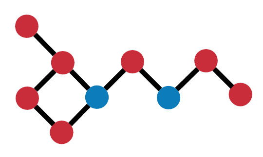

<p align="center">
  
  <h1 align="center" fontsize="2em">d o t m o t i f</h1>
</p>
<p align="center">find graph motifs using friendly notation</p>

# Usage

## Writing a motif

You can currently write motifs in dotmotif form, which is a DSL that specializes in subgraph query notation.

`threecycle.motif`
```
# A excites B
A -> B [type = "excitatory"]
# B inhibits C
B -> C [type = "inhibitory"]
```

## Ingesting the motif into dotmotif

```python
from dotmotif import dotmotif

dm = dotmotif().from_motif("threecycle.motif")
```

You can also pass optional parameters into the constructor for the `dotmotif` object. Those arguments are:

| Argument | Type, Default | Behavior |
|----------|------|----------|
`ignore_direction` | `bool`: `False` | Whether to disregard direction when generating the database query |
| `limit` | `int`: `None` | A limit (if any) to impose on the query results |
| `enforce_inequality` | `bool`: `False` | Whether to enforce inequality; in other words, whether two nodes should be permitted to be aliases for the same node. For example, in `A->B->C`; if `A!=C`, then set to `True` |


For more details on how to write a query, see [Getting Started](docs/start.md).
